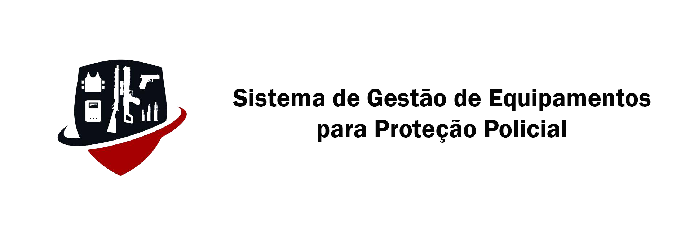

# SIGEP

## Sistema de Gestão de Equipamentos para Proteção Policial

O Sistema de Gestão de Equipamentos para Proteção Policial (SIGEP) é um software de cadastro e gerenciamento de materiais bélicos e equipamentos de proteção individual (EPIs) presentes em cada organização policial militar (OPM), bem como o gerenciamento das cautelas¹ destes materiais pelos policiais de suas respectivas unidades.

1. Termo utilizado no ambiente militar para caracterizar a guarda temporária de patrimonio institucional.

### Pre-requisitos

* Servidor PHP instalado. Ex.: [XAMPP](https://www.apachefriends.org/download.html) ou [WAMP](http://www.wampserver.com/en/)

### Instalação

### Execução

1. Criar o banco de dados na pasta [sql/](https://github.com/rodrigoaggeu/GP3U/tree/master/sql)
2. Iniciar o servidor PHP
3. Em um navegador acessar pagina [localhost](http://localhost)
4. Acessar o diretório do projeto (pode variar dependendo de qual servidor for ultilizado)

## Desenvolvido com

* [PHP](http://php.net/) - Linguagem de programação utilizada
* [Material Design Lite](https://getmdl.io/) - Framework de telas
* [Bootstrap 4](https://getbootstrap.com/) - kit de ferramentas de código aberto para desenvolvimento com HTML, CSS e JS.
* [Java Script](https://www.javascript.com/) - Linguagem de programação interpretada

## Colaboradores

* **Bruno Silva** - [silv4b](https://github.com/silv4b)
* **Isaac José** - [isaacJose](https://github.com/isaacJose)
* **Rodrigo Aggeu** - [rodrigoaggeu](https://github.com/rodrigoaggeu)
* **Vanderson Fabio** - [vandersonfabio](https://github.com/vandersonfabio)

## Responsabilidades + Gerência

### Gerente atual: [isaacJose](https://github.com/isaacJose)

#### Iteração atual: 6ª

| *Iteração* | *Aluno*     | *Função*      | *Inicio - Fim*          |
| ---------- | ----------- | ------------- | ----------------------- |
| *1*        | *Vanderson* | *Gerente*     |*13/08/2018 - 28/08/2018*|
| 1          | Isaac       | Desenvolvedor |                         |
| 1          | Bruno       | Desenvolvedor |                         |
| 1          | Rodrigo     | Desenvolvedor |                         |
| -          | -           | -             |                         |
| 2          | Vanderson   | Desenvolvedor |                         |
| *2*        | *Isaac*     | *Gerente*     |*28/08/2018 - 11/092018* |
| 2          | Bruno       | Desenvolvedor |                         |
| 2          | Rodrigo     | Desenvolvedor |                         |
| -          | -           | -             |                         |
| 3          | Vanderson   | Desenvolvedor |                         |
| 3          | Isaac       | Desenvolvedor |                         |
| *3*        | *Bruno*     | *Gerente*     |*11/09/2018 - 24/092018* |
| 3          | Rodrigo     | Desenvolvedor |                         |
| -          | -           | -             |                         |
| 4          | Vanderson   | Desenvolvedor |                         |
| 4          | Isaac       | Desenvolvedor |                         |
| 4          | Bruno       | Desenvolvedor |                         |
| *4*        | *Rodrigo*   | *Gerente*     |*24/09/2018 - 09/10/2018*|
| -          | -           | -             |                         |
| 5          | Vanderson   | Desenvolvedor |                         |
| 5          | Isaac       | Desenvolvedor |                         |
| *5*        | *Bruno*     | Gerente       |*09/10/2018 - 24/10/2018*|
| 5          | Rodrigo     | Desenvolvedor |                         |
| -          | -           | -             |                         |
| 6          | Vanderson   | Desenvolvedor |                         |
| *6*        | *Isaac*     | *Gerente*     |*30/10/2018 - 13/10/2018*|
| 6          | Bruno       | Desenvolvedor |                         |
| 6          | Rodrigo     | Desenvolvedor |                         |
| -          | -           | -             |                         |

## Licença

This project is licensed under the MIT License - see the [LICENSE](https://github.com/rodrigoaggeu/GP3U/blob/master/LICENSE) file for details.
